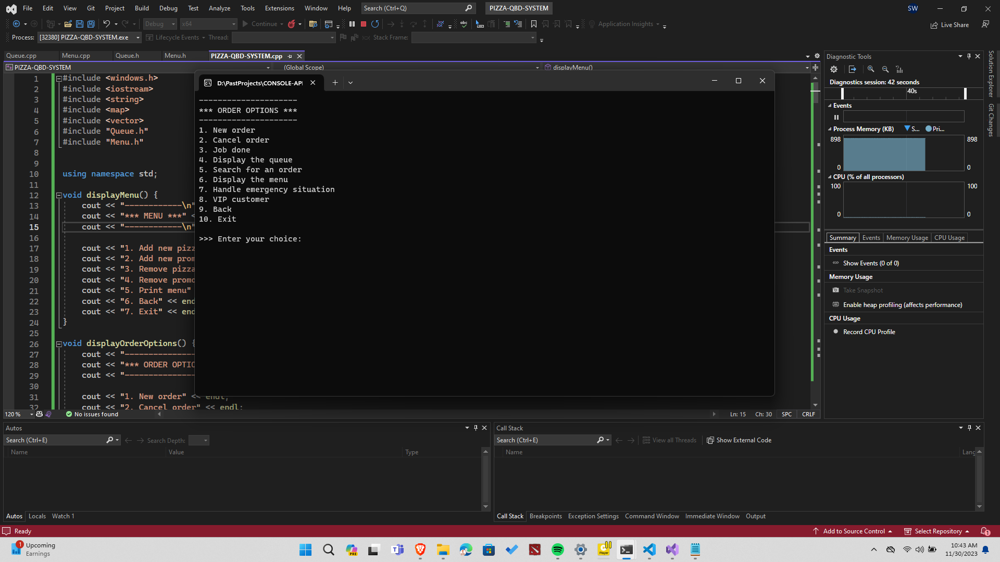
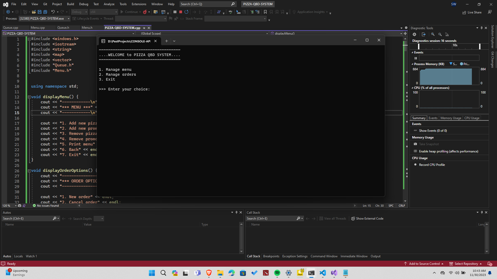
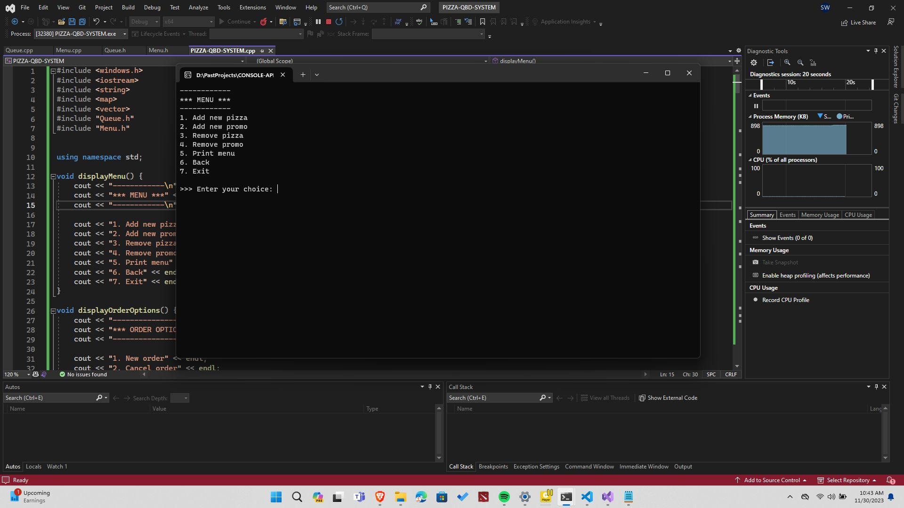
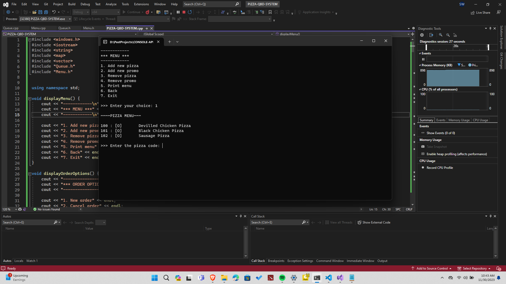

# Pizza QBD System

## Project Overview

There is high foot traffic in pizza shops in most crowded cities, and there are many pizza shops in many cities. However, there hasn't been a system for managing queues efficiently. The Pizza QBD system aims to address this gap by providing an advanced system integrated with billing and delivery systems.

### Features

- Efficient queue management
- Dynamic menu with update and promotion options
- Different order types: Dine-in, Pick up, Delivery
- Emergency situation handling
- VIP customer support

## Screenshots

### Sample Screenshot 01


*Screenshot 01*

### Sample Screenshot 02


*Screenshot 02*

### Sample Screenshot 03


*Screenshot 03*

### Sample Screenshot 04


*Screenshot 04*

## Getting Started

### Prerequisites

- C++ compiler
- Windows operating system

### Installation

1. Clone the repository.
   ```bash
   git clone https://github.com/sweerasingha/CONSOLE-APP-PIZZA-QBD-SYSTEM
   cd pizza-qbd-system
